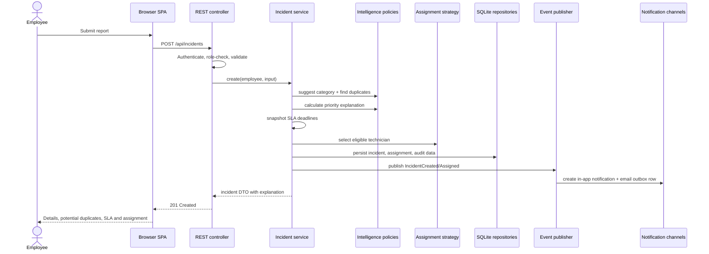

# Incident creation sequence diagram

```mermaid
sequenceDiagram
  actor E as Employee
  participant UI as Browser SPA
  participant API as REST controller
  participant IS as Incident service
  participant INT as Intelligence policies
  participant AS as Assignment strategy
  participant DB as SQLite repositories
  participant EVT as Event publisher
  participant N as Notification channels

  E->>UI: Submit report
  UI->>API: POST /api/incidents
  API->>API: Authenticate, role-check, validate
  API->>IS: create(employee, input)
  IS->>INT: suggest category + find duplicates
  IS->>INT: calculate priority explanation
  IS->>IS: snapshot SLA deadlines
  IS->>AS: select eligible technician
  IS->>DB: persist incident, assignment, audit data
  IS->>EVT: publish IncidentCreated/Assigned
  EVT->>N: create in-app notification + email outbox row
  IS-->>API: incident DTO with explanation
  API-->>UI: 201 Created
  UI-->>E: Details, potential duplicates, SLA and assignment
```

The event publisher is intentionally after persistence: a notification should always refer to a real incident ID and audit event.
