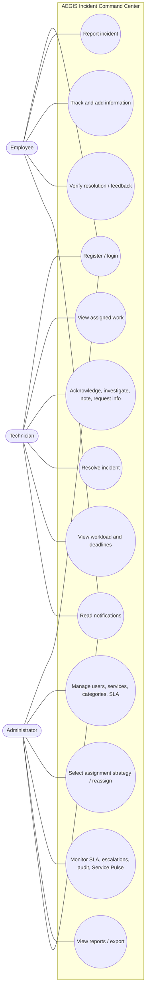

# UML use case diagram

```mermaid
flowchart LR
  employee([Employee])
  technician([Technician])
  admin([Administrator])

  subgraph AEGIS[AEGIS Incident Command Center]
    login((Register / login))
    report((Report incident))
    track((Track and add information))
    verify((Verify resolution / feedback))
    assigned((View assigned work))
    investigate((Acknowledge, investigate, note, request info))
    resolve((Resolve incident))
    workload((View workload and deadlines))
    govern((Manage users, services, categories, SLA))
    strategy((Select assignment strategy / reassign))
    monitor((Monitor SLA, escalations, audit, Service Pulse))
    analytics((View reports / export))
    notifications((Read notifications))
  end

  employee --- login
  employee --- report
  employee --- track
  employee --- verify
  employee --- notifications
  technician --- login
  technician --- assigned
  technician --- investigate
  technician --- resolve
  technician --- workload
  technician --- notifications
  admin --- login
  admin --- govern
  admin --- strategy
  admin --- monitor
  admin --- analytics
  admin --- notifications
```

The relationships are enforced by server-side role checks. A screen hidden in the client is not relied on as an authorization boundary.
